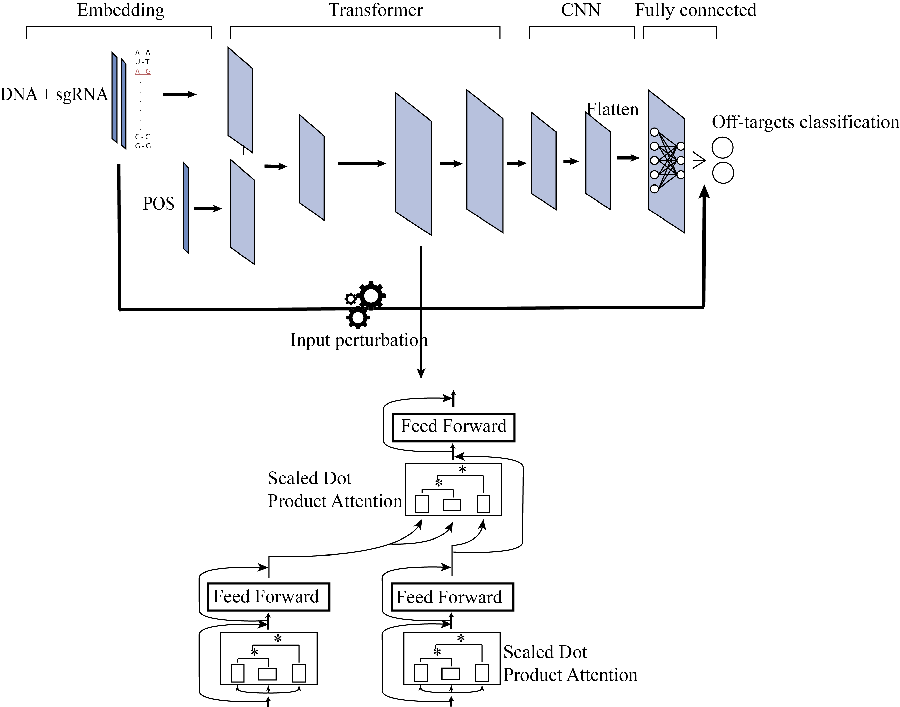
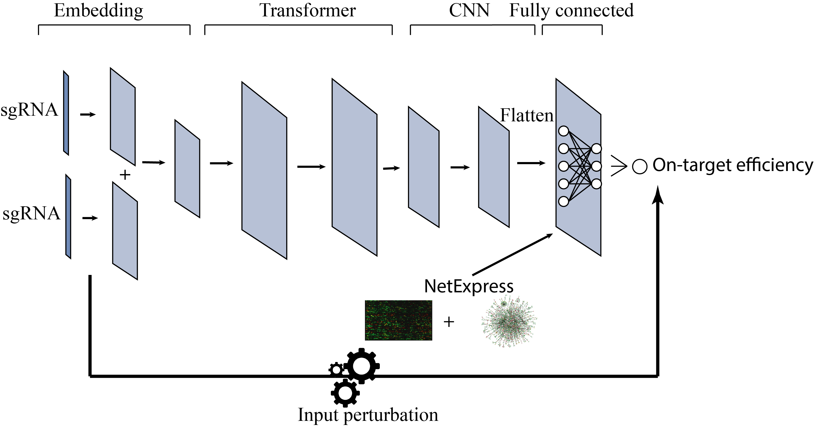

# Overview

This project is intended to use deep learning models for Crispr-Cas on-target efficiency prediction and off target specificity prediction.

Below is the layout of the whole model.

## AttnToMismatch_CNN

<p align="center">
  
</p>

This model includes four components: 
* Embedding layer
* Transformer layer
* Convolutional neural network
* Fully connected layer

## AttnToCrispr_CNN

<p align="center">
  
</p>

This model includes four components: 
* Embedding layer
* Transformer layer
* Convolutional neural network
* Fully connected layer

# Requirement

* keras
* tensorflow
* pytorch
* sklearn
* pandas
* numpy

# Usage
## Specify which model to use

change the model directory in config.py when old model need to be loaded for testing
```
loaded_model_path = os.path.join(cur_dir, "dataset/best_model/<cellline>_lstm_model.h5")
```

## Specify which dataset to use
```

```
## Run the program and get prediction result

Make sure the data is in dataset/\<cellline\>/ folder and execute
```
python ./attn_to_crispr.py dataset/<cellline>
```